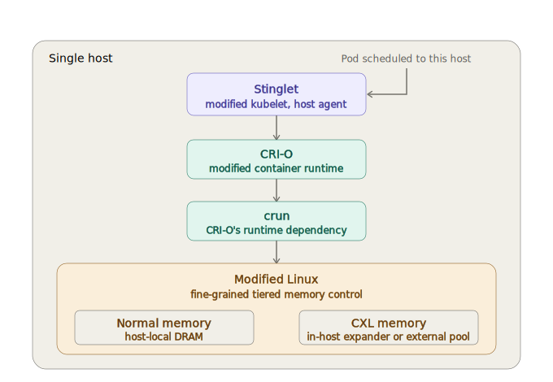
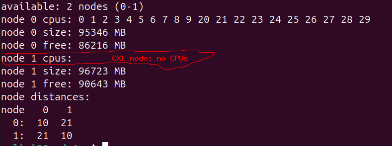
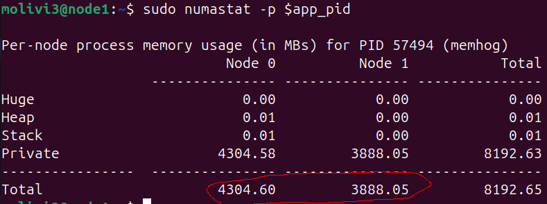

# Stinglet Demo

This repo contains a demo of Stinglet. Stinglet is a cluster manager host
agent with native support for CXL memory. It is implemented as
a modified version of
[kubelet](https://kubernetes.io/docs/concepts/architecture/#kubelet) v1.33
([K8s](https://kubernetes.io/docs/concepts/architecture/)' host agent).

Furthermore, Stinglet relies on a modified Linux kernel (v6.6) which supports
fine-grained control over how much memory applications allocate on each
tier of memory (where the tiers are *normal*, i.e., host-local, and CXL memory).
This fine-grained control ensures that K8s Pods don't starve each other
of normal memory; because the memory usage limits of a container are
configured by the container runtime, Stinglet further modifies the
[CRI-O](https://github.com/cri-o/cri-o) container runtime and its dependency
[crun](https://github.com/containers/crun) to use the fine-grained memory usage
limits of the custom Linux. We refer to Stinglet's custom Linux, CRI-O and crun
as Stinglet's *dependencies*. The single-host view of the resuling architecture
is shown below:



To set up the demo on a machine you have to install and run the custom Linux,
CRI-O and crun on that machine (this repo includes git submodules to their
github repos); we recommend you don't do that on your personal laptop.

For ease of set up the demo runs Stinglet in
[standalone mode](https://kubernetes.io/docs/tutorials/cluster-management/kubelet-standalone/),
meaning that you don't need a complete K8s cluster comprising the control
plane and multiple worker hosts; a single host where only Stinglet runs is
enough ([pods are created by placing their manifests in a directory that Stinglet
monitors](https://kubernetes.io/docs/concepts/workloads/pods/static-pods/),
rather than calling the K8s API). 

Note that Stinglet goal is allocating normal and CXL memory plugged to its host
across Pods, not to orchestrate assignment of pooled CXL memory across hosts.
Consequently, the demo assumes that some CXL memory is available to the host,
either via an in-host expander or a CXL pool memory currently plugged to the host
(stay tuned for instructions of how to simulate CXL memory if you don't have
real one).

Without further ado, here are the demo steps:
- [Build and Install Stinglet and its Dependencies](#build-and-install-stinglet-and-its-dependencies)
  - [Step 1: Clone this Repo and Set it as Working Directory](#step-1-clone-this-repo-and-set-it-as-working-directory)
  - [Step 2: Pull the Submodules for Stinglet and its Dependencies](#step-2-pull-the-submodules-for-stinglet-and-its-dependencies)
  - [Step 3: Build and Install the Custom Linux Kernel](#step-3-build-and-install-the-custom-linux-kernel)
  - [Step 4: Build and Install CRI-O and crun](#step-4-build-and-install-cri-o-and-crun)
  - [Step 5: Build and Install Stinglet](#step-5-build-and-install-stinglet)
- [Run Stinglet and Deploy an Application](#run-stinglet-and-deploy-an-application)
- [Stop Stinglet](#stop-stinglet)
- [TODOs](#todos)

## Build and Install Stinglet and Its Dependencies

### Step 1: Clone this Repo and Set it as Working Directory

Run:

```bash
git clone https://github.com/GTkernel/stinglet-demo && \
    cd stinglet-demo
```

### Step 2: Pull the Submodules for Stinglet and its Dependencies

Run:

```bash
git submodule update --init --recursive
```

Note: the command might take a few minutes to complete.

### Step 3: Build and Install the Custom Linux Kernel

> [!WARNING]
> This step has been tested only on Ubuntu 24.04. The high-level workflow is the same across all distributions, but the exact commands to run and their syntax might be different in different distributions.

Run the following **interactive** script (when it pauses to ask you for input,
just press enter):

```bash
build-and-install/3-linux.sh
```

The script takes from several minutes to one or two hours (depending on the number of CPUs,
the currently loaded modules, and the current kernel config of your machine), but the interactive
part is only during the first 5 minutes, so after 5 minutes you no longer need to attend to it.

After the script is done, you need to identify the name of the new kernel, and make it the default
kernel to use on reboot.

The new kernel name includes the string `stinglet` and does NOT include the string `recovery`.
On Ubuntu 24.04, file `/boot/grub/grub.cfg` includes one line with the kernel name, so we can grep the file
for `stinglet`, but there will be multiple matches and the matching line itself contains noise.
Extract only the kernel name with:

```bash
kernel_name=$(sudo grep stinglet /boot/grub/grub.cfg | grep menuentry | grep -v recovery | head -1 | sed "s/^\s*menuentry '\([^']*\)'.*/\1/")
```

Then, make the new kernel the default as:

```bash
sudo sed -i "s/^GRUB_DEFAULT=.*/GRUB_DEFAULT=\"Advanced options for Ubuntu>${kernel_name}\"/" /etc/default/grub
sudo update-grub
```

Finally, reboot:

```bash
sudo reboot
```

Upon rebooting, the new kernel should be running. To verify this, run:

```bash
uname -r
```

and check that the output contains the string `stinglet-fg-cgroups`. For example, on a successful
installation we'd see:

```bash
uname -r
6.6.0-stinglet-fg-cgroups+
```

### Step 4: Build and Install CRI-O and crun

Run:

```bash
sudo build-and-install/4-crio-and-crun.sh
```

It will take a few minutes to run. When done, verify that our custom CRI-O and crun have been installed.

To do that, begin by checking that the binaries at the default paths are the ones in our submodules;
you can compare the binaries' md5s to make sure they are identical:

CRI-O:

```bash
md5sum components/cri-o/bin/crio /usr/bin/crio /usr/local/bin/crio
```

crun:

```bash
md5sum components/crun/crun /usr/libexec/crio/crun
```

If they are identical, you're good, otherwise, there's a bug.

Then, check that the binaries in our submodules have been built from the submodules' pinned commits.

```bash
git submodule status components/crun components/cri-o
```

Neither line may start with a `+` (a `+` means the checkout has drifted from the pinned commit).

If no line starts with a `+` the installation was successful, otherwise, there's a bug.

### Step 5: Build and Install Stinglet

Run:

```bash
build-and-install/5-stinglet.sh
```

## Run Stinglet and Deploy an Application

Run:

```bash
./run.sh
```

On success, the output should be:

```text
// some other prints...

CRI-O up and running.

// some other prints...

Stinglet up and running.
Success!
```

Now that Stinglet is up and running, we will try it by deploying a demo application (app).

The app allocates ~8 GiB of memory and then sleeps, but requests that 4 of those 8 GiB are
allocated on CXL memory through Stinglet's API. The source code is at
[demo-app/memhog.c](demo-app/memhog.c), while the
YAML manifest of the Pod is at [demo-app/pod.yaml](demo-app/pod.yaml).
Note [the Pod annotation](demo-app/pod.yaml#9) to request the 4 GiB of CXL memory.
The container image of the pod has been pulled by the `run.sh` script we've
already executed.

On the server where I tested the demo, there were two NUMA nodes: node 0, a normal node with both CPUs and local DRAM, and node 1, a CPU-less, CXL node, as shown in the following picture:

.

Now let's create the pod by copying its manifest to Stinglet's static pods path:

```bash
sudo cp demo-app/pod.yaml /etc/kubernetes/manifests
```

We can verify that the pod is up and running by querying Stinglet's API:

```bash
curl -s http://localhost:10255/pods | jq '.items[].status.containerStatuses[]? | {state: (.state | keys[0])}'

# The following is the expected output.
{
  "state": "running"
}
```

It takes a few seconds for the pod to start, so you might have to run the command a few times
before the pod is running.

Once the pod is running, let's verify that stinglet is giving to it 4 GiB of local memory (NUMA
node 0) and 4 GiB of CXL memory (NUMA node 1) as requested. First, get the PID of the Pod:

```bash
app_pid=$(sudo crictl inspect $(sudo crictl ps --name memhog -q) | jq '.info.pid')
```

Then, check how much memory the Pod is using on each NUMA node:

```bash
watch sudo numastat -p $app_pid
```

After a few seconds, the output should show that the pod is using
(roughly) 4 GiB on each node:



This concludes our demo. Note that your machine might have more NUMA nodes
and the IDs of the normal/CXL nodes might be different than those on my machine, so you'd see a
different result, but what matters is that the demo app uses ~4 GiB on the CXL nodes and 4 GiB on
the local nodes.   

## Stop Stinglet

Once done with the experiments, you can stop Stinglet (and CRI-O):

```bash
./stop.sh
```

Note that the script deletes all currently running pods and waits for them to
have been actually deleted by the container runtime - that might take up to a few minutes. 

## TODOs:

...to improve the demo.

1. Automate kernel installation more (e.g., by auto-updating grub and entering config defaults).
2. Automate CRI-O and crun installation checks.
3. Make scripts idempotent and more robust (e.g., allow them to pick up from where they
left in case of partial failures).
4. Make scripts portable to other Linux distros (e.g., Ubuntu 22.02 and Fedora).
5. Harmonize scripts layout (e.g., move them all to a common `scripts/` folder and\
give better names).
6. Add instructions to simulate CXL memory out of normal memory.
